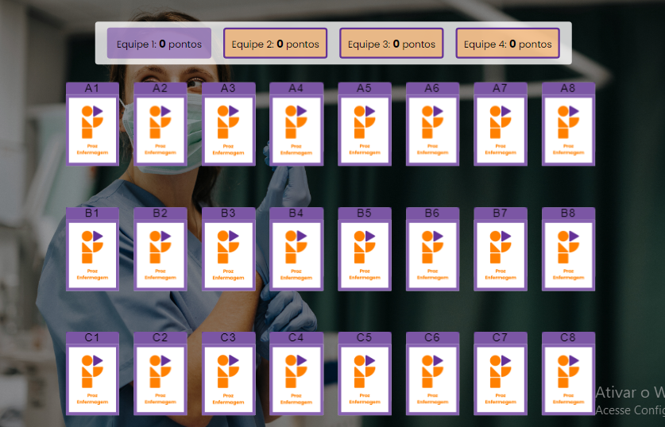

<h1 align="center">Jogo da Memoria</h1>

<p align="center">
  
</p>

<p align="center">
  <strong>Um divertido jogo de correspondência de cartas com imagens de personagens relacionados à área da saúde.</strong>
</p>

## Como Jogar

O objetivo do jogo é encontrar todos os pares de cartas com o mesmo personagem. Clique em duas cartas para revelá-las. Se as cartas formarem um par correspondente, elas permanecerão viradas para cima. Caso contrário, elas serão ocultadas novamente. O jogo continua até que todos os pares sejam encontrados.

## Tecnologias Utilizadas

- HTML
- CSS
- JavaScript

## Funcionalidades

- Grade de cartas dinâmica e embaralhada a cada partida.
- Pontuação para cada equipe.
- Final do jogo com exibição da equipe vencedora.

## Como Executar

1. Clone o repositório:
   ```shell
   git clone https://github.com/jeanaraga/memory-game-main.git

2. Navegue até o diretório do projeto:
cd memory-game-main

3. Abra o arquivo index.html em seu navegador.

## Personalização
Você pode personalizar o jogo alterando as imagens dos personagens. Basta substituir as imagens na pasta images por outras imagens de sua escolha, mantendo os nomes dos arquivos.

## Contribuição
Contribuições são bem-vindas! Sinta-se à vontade para abrir uma issue ou enviar um pull request com melhorias, correções de bugs ou novas funcionalidades.

## Licença
Este projeto está licenciado sob a licença MIT.